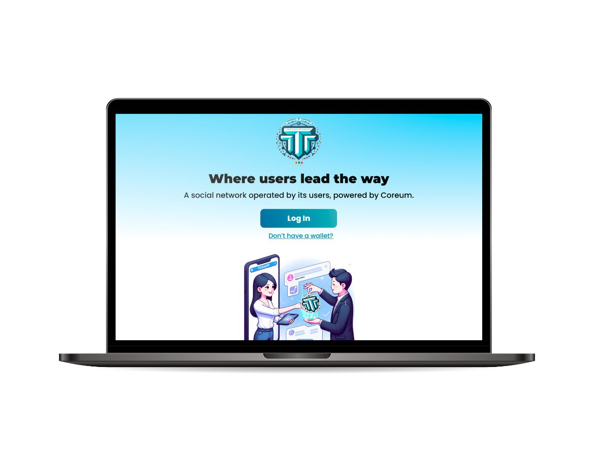

# token-titans

TokenTitans is a diverse and multi-disciplinary team dedicated to revolutionizing the SocialFi landscape. Our project combines a wide range of cultural backgrounds and expertise, enabling us to have a comprehensive perspective on the direction our project should take. We are committed to identifying the key features and functionalities that make SocialFi appealing, with a focus on returning power to content creators.

# Key Features

Our TokenTitans SocialFi decentralized application (dApp) offers a set of powerful features:

<li>Profile Creation: Users can create their unique profiles, allowing them to curate and share content seamlessly.</li>

<li>Community Creation: The ability to establish online communities tailored to specific interests and themes.</li>

<li>Join Community: Users can easily connect with like-minded individuals by joining existing communities. </li>

<li>TTD dApp Token: We introduce the TTD dApp token, a revolutionary digital asset that empowers content monetization and rewards our dedicated users.</li>

<li>Coreum Network Integration: To ensure robustness and scalability, our dApp is built on the Coreum network, providing a resilient foundation for growth.</li>

# Competition & Ecosystem

In the competitive landscape, we distinguish ourselves from key players like DeBank and Tech.friend:

<li>DeBank: DeBank emphasizes transparency and measures success through Total Value of Followers (TVL).</li>

<li>Tech.friend: Tech.friend focuses on exclusivity but has a cumbersome user experience, with numerous entry barriers.</li>

The prevailing trend of content ownership and monetization aligns perfectly with our mission. TokenTitans SocialFi dApp offers a compelling solution to users who seek content freedom and the ability to establish their online communities. Our platform provides content creators with a unique opportunity to shape their content and communities as they see fit.

# Team Members

Our dedicated team members include:

<li>Miguel: Manager/Scrum Master familiar with agile methodologies and frameworks.</li>
<li><a href="https://github.com/paulfresnel">Paul</a>: A Digital Marketing Manager with over 5 years of exxperience, who recently transitionned to a full-stack web developer with a passion for Blockchain & crypto.</li>
<li>Maria: Web Designer and Graphic Designer, using UX methods for communications | Founder of Nh4utilus Creative Agency.</li>
<li>Oussamahn: [Details not provided]</li>

# Deployed dApp

Experience our innovative dApp by visiting <a href="https://token-titans.vercel.app/">TokenTitans</a>. We are proud to announce that our dApp is live on the Coreum Testnet network, ensuring reliability, performance and cheap costs for our users.

TokenTitans is committed to empowering content creators in the SocialFi space, and we invite you to explore the possibilities of our platform.

Don't hesitate to leave a comment on this repo if you have any feedback or wish to collaborate.

